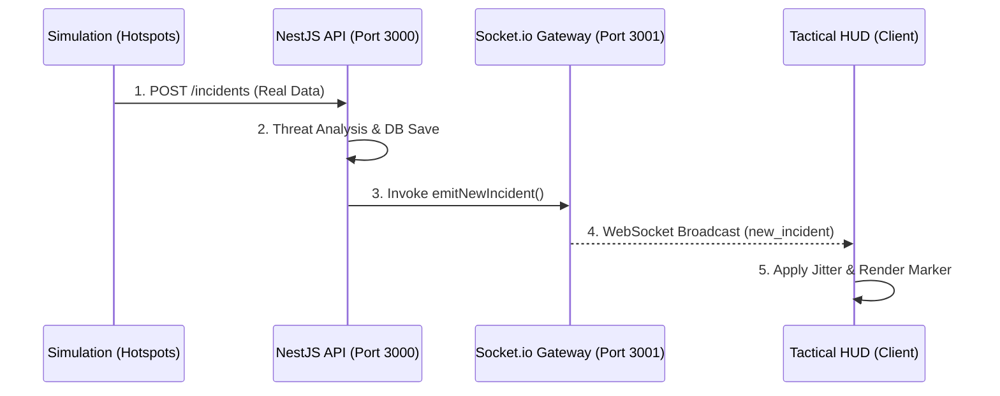
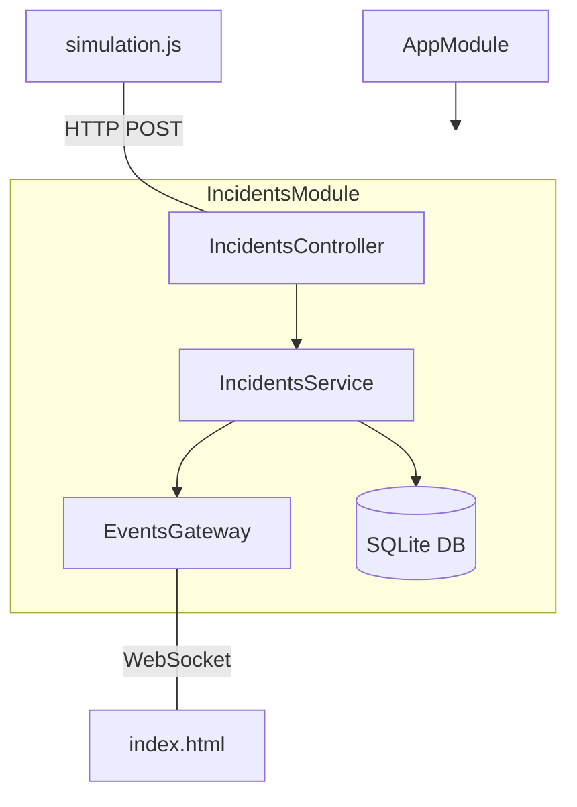

# 🏗️ OVERWATCH SYSTEM ARCHITECTURE

ความสัมพันธ์ของ Components และการไหลของข้อมูลภายในระบบ Overwatch.

## 📡 Data Flow Diagram

## 🧩 Module Map (NestJS)

## ⚙️ Component Breakdown

| Component | Responsibility | Tech Stack |
|-----------|----------------|------------|
| **Simulation** | จำลองเหตุการณ์จาก Hotspots จริง | Node.js (Fetch API) |
| **Incidents API** | รับข้อมูล, วิเคราะห์ Priority, จัดเก็บลง DB | NestJS, TypeORM, SQLite |
| **Events Gateway** | กระจายข้อมูลแบบ Real-time (Zero Latency) | Socket.io |
| **Tactical HUD** | แสดงผลแผนที่และเอฟเฟกต์ Cyberpunk | Leaflet.js, Tailwind CSS |
